# Holbos Project

A modified sticky note application

## Made with

**Frontend:** [ReactJS](https://react.dev/), [TailwindCSS](https://tailwindcss.com/docs/installation) and [daisyUI](https://daisyui.com/docs/install/)

### Node Packages used

- React Icons - https://react-icons.github.io/react-icons/
- React Router - https://www.npmjs.com/package/react-router-dom


### Prerequisites

Before beginning, make sure you have [NodeJS](https://nodejs.org/en) and [npm](https://docs.npmjs.com/cli/v9/configuring-npm/install) setup

## Installation

Clone the project into your system using the **git clone** command or simply download and extract the folder

```bash
  git clone https://github.com/sreehariv-code/Smart-Sticky-Notes.git
```

Go to the project directory

```bash
  cd Smart-Sticky-Notes
```

Install dependencies

```bash
  npm install
```

Start the server

```bash
  npm run start
```

## Screenshots

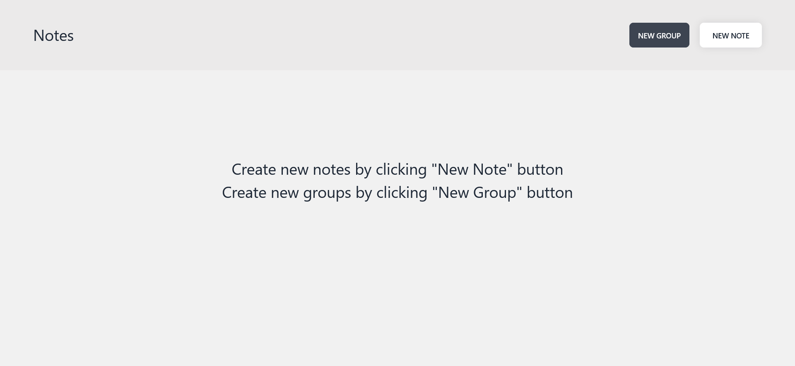
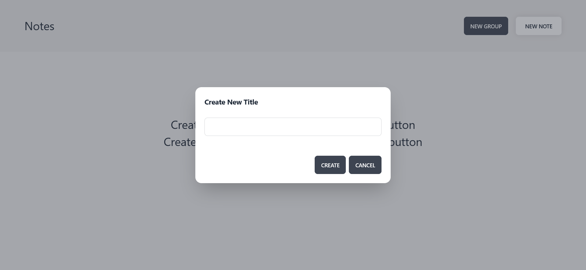
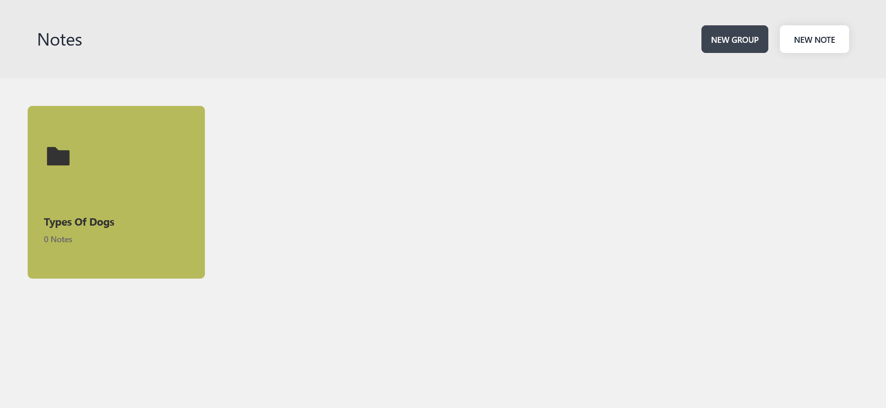
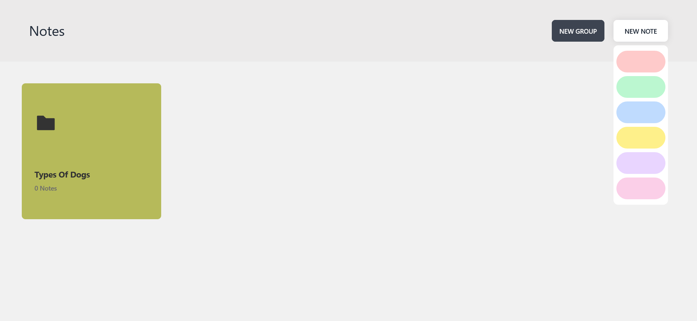
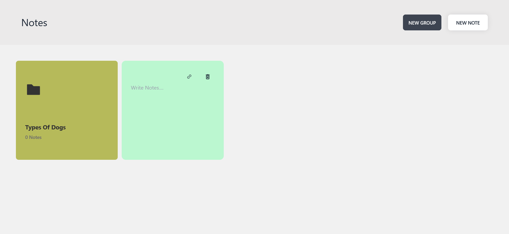
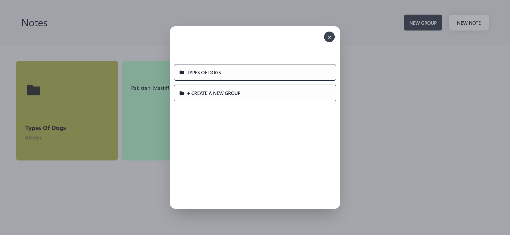
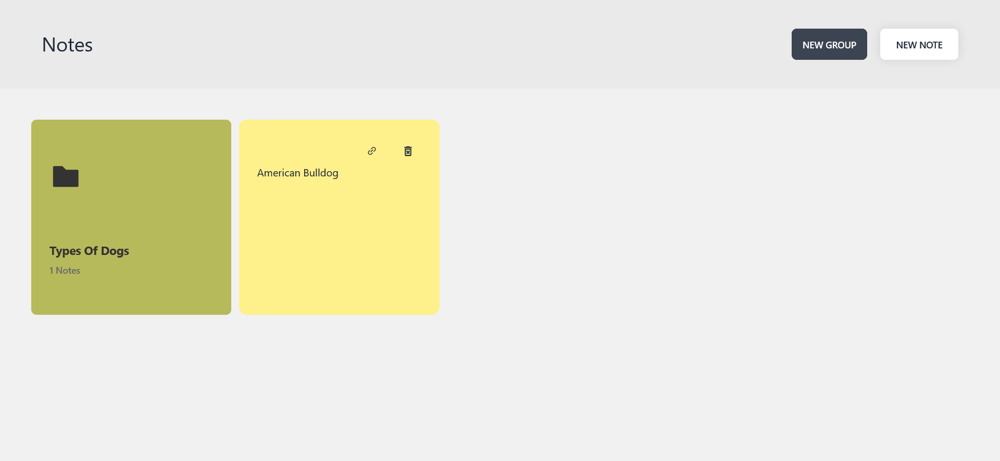
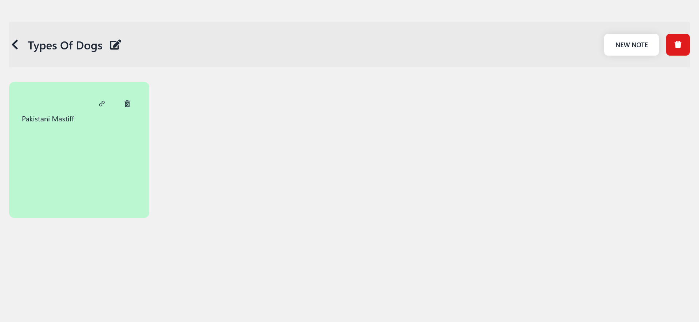
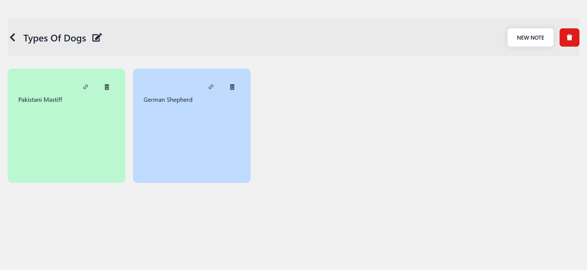
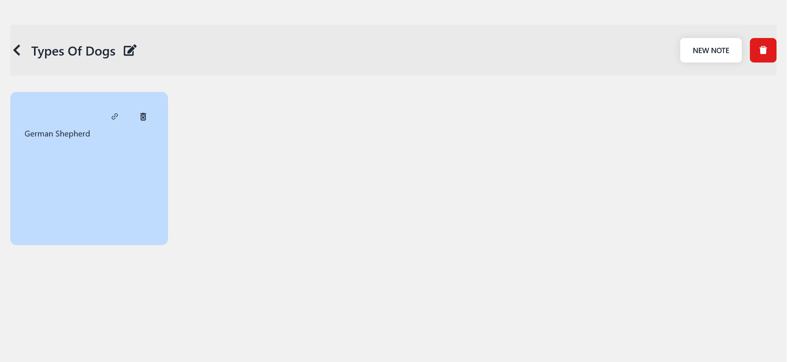
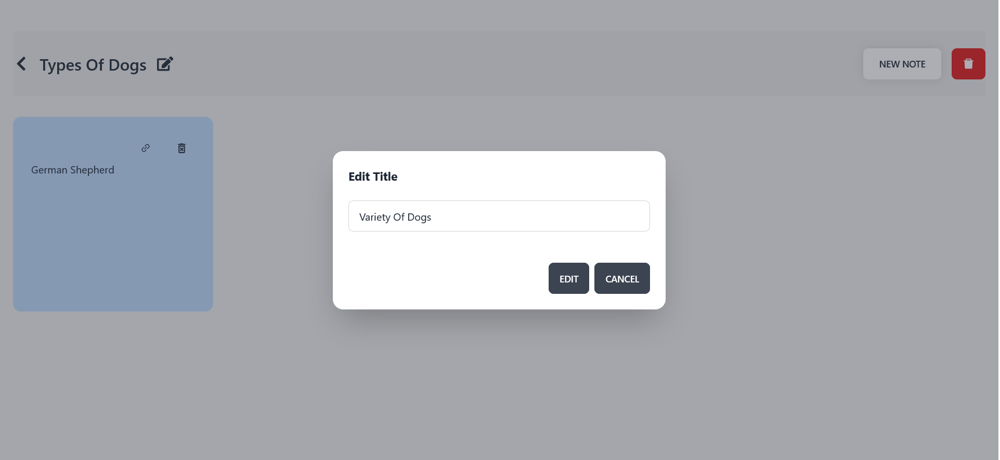
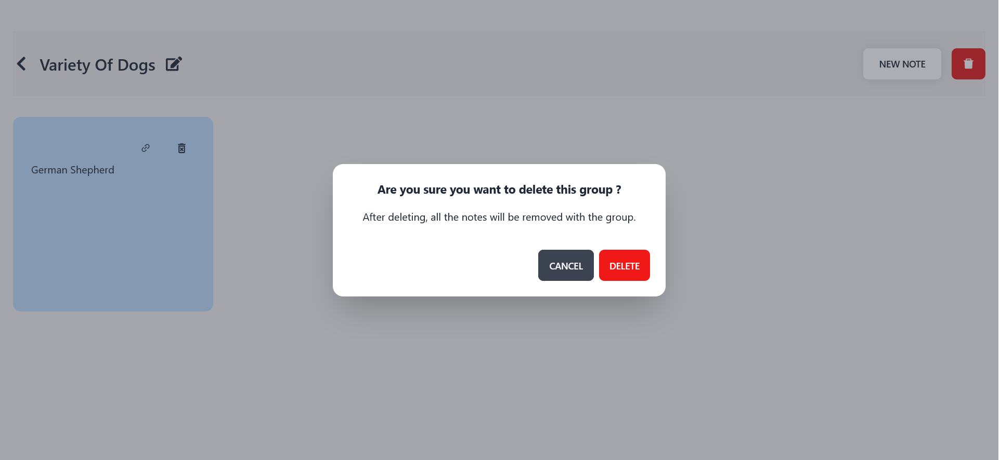
